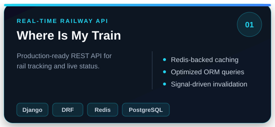
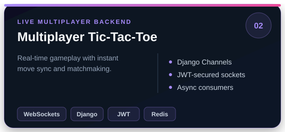
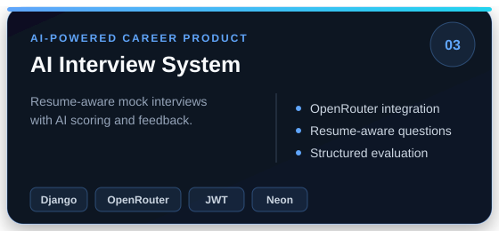
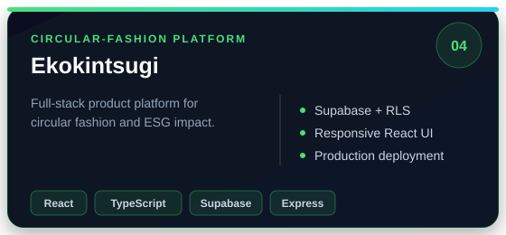
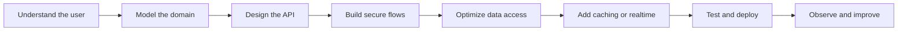
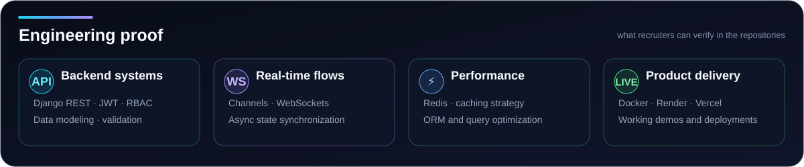

<div align="center">
  
</div>

<div align="center">
  <a href="mailto:adarshpathak2006@gmail.com"></a>
  <a href="./resume/Adarsh_Pathak_ATS_Resume.pdf"></a>
  <a href="https://github.com/adarsh-pathak-2006?tab=repositories"></a>
</div>

<br />

## `01` / About me

```yaml
name: Adarsh DN Pathak
location: Varanasi, India
education: B.Tech, Computer Science & Engineering (AI & ML) — 2028
focus: Backend Engineering · Real-Time Systems · AI Products
currently_building: APIs that are fast, secure, scalable, and useful
```

I build **production-minded backend systems**—from REST APIs and authentication to WebSocket-powered real-time experiences, Redis caching, PostgreSQL data models, and AI integrations. I enjoy turning complex product ideas into clean, deployable software.

- ⚡ **Performance:** caching, query optimization, async communication, and pragmatic system design
- 🔐 **Reliability:** JWT authentication, validation, role-aware access, and maintainable APIs
- 🚀 **Delivery:** Docker, AWS, Render, Vercel, Neon, Supabase, Git, and production workflows
- 🤝 **Experience:** Web Developer & AI Workflow Developer Intern at **Expose Trendze**

> **My north star:** build systems that feel instant to users and remain understandable to engineers.

---

## `02` / Featured work

<table>
<tr>
<td width="50%" valign="top">
<a href="https://github.com/adarsh-pathak-2006/where_is_my_train_backend"></a>
<p align="center">
<a href="https://whereismytrainfrontend.vercel.app/"></a>
<a href="https://github.com/adarsh-pathak-2006/where_is_my_train_backend"></a>
</p>
</td>
<td width="50%" valign="top">
<a href="https://github.com/adarsh-pathak-2006/Tic-Tac-Toe-Multiplayer"></a>
<p align="center">
<a href="https://tic-tac-toe-ui.vercel.app"></a>
<a href="https://github.com/adarsh-pathak-2006/Tic-Tac-Toe-Multiplayer"></a>
</p>
</td>
</tr>
<tr>
<td width="50%" valign="top">
<a href="https://github.com/adarsh-pathak-2006/AI--Interview-System"></a>
<p align="center">
<a href="https://ai-interview-system-frontend.vercel.app/"></a>
<a href="https://github.com/adarsh-pathak-2006/AI--Interview-System"></a>
</p>
</td>
<td width="50%" valign="top">
<a href="https://github.com/adarsh-pathak-2006/Ekokintsugi-Website"></a>
<p align="center">
<a href="https://ekokintsugi-website.onrender.com/"></a>
<a href="https://github.com/adarsh-pathak-2006/Ekokintsugi-Website"></a>
</p>
</td>
</tr>
</table>

<details>
<summary><b>🔎 What recruiters can inspect in these projects</b></summary>
<br />

| Engineering signal | Where to look |
|---|---|
| API design & data modeling | Where Is My Train, AI Interview System |
| WebSockets & async workflows | Multiplayer Tic-Tac-Toe |
| Performance & caching | Where Is My Train |
| Authentication & authorization | Tic-Tac-Toe, AI Interview System |
| AI API integration | AI Interview System |
| Full-stack product delivery | Ekokintsugi |

</details>

---

## `03` / Technical toolkit

<div align="center">
  
</div>

<br />

| Layer | Tools I work with |
|---|---|
| **Backend** | Python, Django, Django REST Framework, Django Channels, REST APIs, WebSockets, JWT |
| **Data** | PostgreSQL, MySQL, SQLite, Redis, Neon, Supabase |
| **Frontend** | JavaScript, TypeScript, React.js, Next.js, HTML5, CSS3 |
| **Cloud & delivery** | AWS, Docker, Render, Vercel, GitHub, Postman |
| **Engineering** | System Design, API Design, Caching, ORM Optimization, Background Workers |

---

## `04` / How I engineer



<details>
<summary><b>🧠 Backend principles I care about</b></summary>
<br />

- **Clear contracts:** predictable endpoints, useful status codes, and structured responses
- **Secure defaults:** secret management, validation, JWT-based access, and role-aware mutations
- **Efficient data paths:** `select_related`, `prefetch_related`, pagination, caching, and invalidation
- **Realtime with purpose:** WebSockets when users benefit from immediate state changes
- **Deployable work:** environment-based configuration, managed databases, and cloud-ready builds

</details>

---

## `05` / GitHub signal

<div align="center">
  
</div>

<br />

<div align="center">
  
</div>

<br />

<div align="center">
  
</div>

<br />

<picture>
  <source media="(prefers-color-scheme: dark)" srcset="https://raw.githubusercontent.com/adarsh-pathak-2006/adarsh-pathak-2006/output/github-contribution-grid-snake-dark.svg" />
  <source media="(prefers-color-scheme: light)" srcset="https://raw.githubusercontent.com/adarsh-pathak-2006/adarsh-pathak-2006/output/github-contribution-grid-snake.svg" />
  
</picture>

<sub>GitHub metrics and contribution visuals are generated inside this repository and refreshed every day—no fragile public stats-card services.</sub>

---

## `06` / Current direction

```text
Deepening     → Django architecture, async Python, system design
Building      → Real-time products and AI-assisted workflows
Improving     → Testing, observability, deployment, and performance
Looking for   → Hard problems, strong teams, and meaningful products
```

---

## `07` / Let's build something useful

<div align="center">
  <h3>Have a backend, realtime, or AI product idea?</h3>
  <p>I would love to hear about the problem you are solving.</p>
  <a href="mailto:adarshpathak2006@gmail.com"></a>
  <a href="https://github.com/adarsh-pathak-2006"></a>
  <br /><br />
  
</div>

<!--
Recruiter-friendly profile README designed for clarity, proof of work, and fast scanning.
Keep featured projects current. Replace or reorder cards as your portfolio grows.
-->
